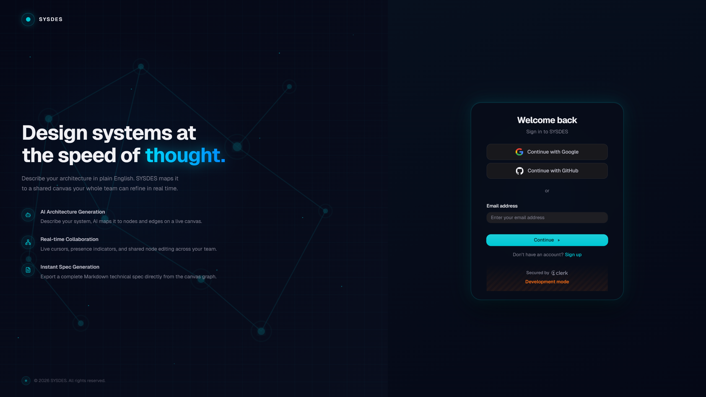
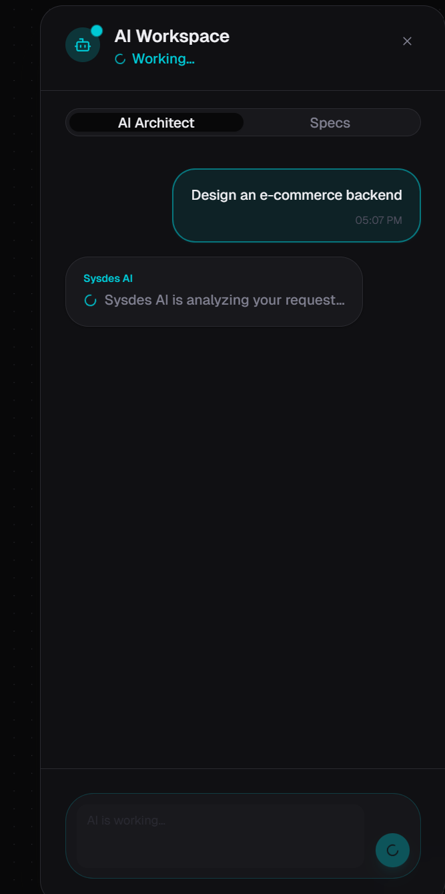
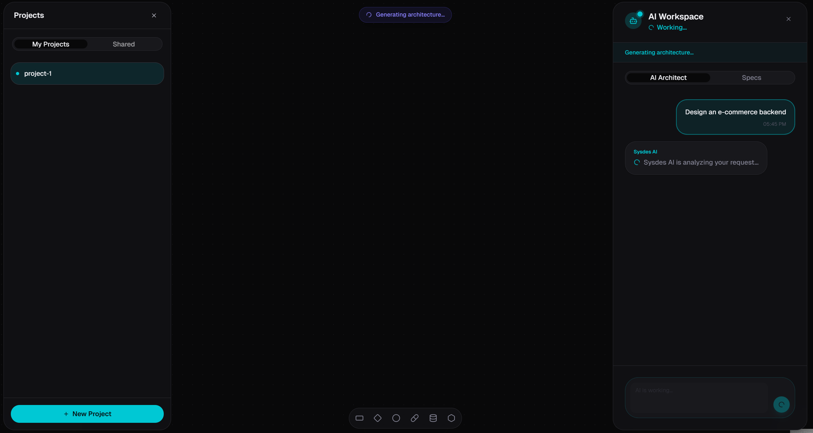
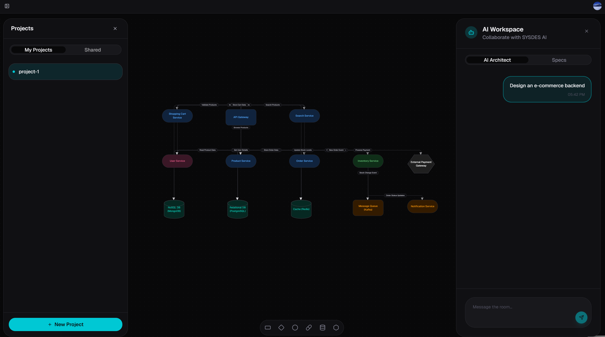
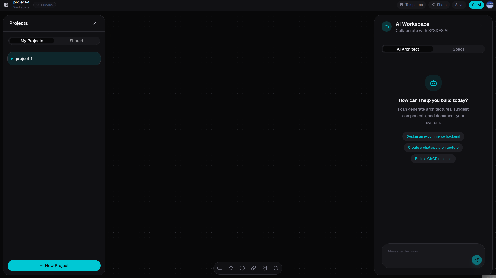

# SYSDES

**Design systems at the speed of thought.**

Describe your architecture in plain English. SYSDES maps it to a shared canvas your whole team can refine in real time.



---

## What It Does

SYSDES is an AI-powered system design tool. You describe what you want to build — the AI generates a live, editable architecture diagram on a shared canvas. Your team collaborates on it in real time, then exports a complete Markdown technical spec directly from the graph.

**Core workflow:**

1. Sign in and create a project
2. Prompt the AI to generate an architecture
3. Collaborate on the canvas with your team
4. Export a Markdown technical spec

---

## Features

### 🤖 AI Architecture Generation

Describe your system in plain English. The AI generates structured nodes and edges directly into the shared canvas via a durable background task — no timeouts, no dropped requests.





### 🖊️ Real-Time Collaborative Canvas

Live cursors, presence indicators, and shared node/edge editing — multiple users working on the same canvas simultaneously.



### 📋 Instant Spec Generation

Export a complete Markdown technical specification from the current canvas graph. Specs are persisted and available for download.

### 🗂️ Starter Templates

Import prebuilt system design templates (monolith, microservices, event-driven, serverless, and more) into any canvas at any time.



---

## Tech Stack

| Layer | Technology | Role |
|---|---|---|
| Framework | **Next.js 16 + TypeScript** | Full-stack app with server/client boundaries |
| UI | **Tailwind CSS + shadcn/ui** | Component composition and styling |
| Auth | **Clerk** | User identity and route protection |
| Database | **Prisma + PostgreSQL** | Projects, collaborators, specs, task run records |
| Canvas | **Liveblocks + React Flow** | Real-time collaborative canvas, presence, cursors |
| Background Tasks | **Trigger.dev** | Durable AI generation workflows |
| Artifact Storage | **Vercel Blob** | Canvas snapshots and generated Markdown specs |
| AI | **Claude (Anthropic)** | Architecture generation and spec writing |

---

## Architecture

```
app/api          → Authenticated request handlers — validation, auth, task triggering
trigger/         → Long-running background jobs — AI design + spec generation
lib/             → Shared infrastructure — Prisma client, access control, utilities
components/      → UI — canvas surfaces, sidebars, dialogs, interactive elements
prisma/          → Schema, migrations, generated client
```

**Storage split:**
- **PostgreSQL** — project metadata, ownership, collaborators, spec records, task run records
- **Vercel Blob** — canvas snapshots (`canvas/{projectId}.json`) and specs (`specs/{projectId}/{specId}.md`)

**AI generation pipeline:**
- User prompt → API route → Trigger.dev background task → Claude generates nodes/edges → written into shared Liveblocks room
- Canvas graph → Trigger.dev background task → Claude writes Markdown spec → saved to Vercel Blob → linked in database

---

## Getting Started

### Prerequisites

- Node.js 18+
- PostgreSQL database
- Accounts for: Clerk, Liveblocks, Trigger.dev, Vercel Blob, Anthropic

### Environment Variables

```env
# Auth
NEXT_PUBLIC_CLERK_PUBLISHABLE_KEY=
CLERK_SECRET_KEY=

# Database
DATABASE_URL=
DIRECT_DATABASE_URL=

# Liveblocks
LIVEBLOCKS_SECRET_KEY=

# Trigger.dev
TRIGGER_SECRET_KEY=

# Vercel Blob
BLOB_READ_WRITE_TOKEN=

# AI
ANTHROPIC_API_KEY=
```

### Install and Run

```bash
npm install
npx prisma migrate dev
npm run dev
```

For background tasks, in a separate terminal:

```bash
npx trigger.dev@latest dev
```

---

## Project Structure

```
app/                  Next.js app router — pages and API routes
components/
  editor/             Canvas editor, AI sidebar, toolbar
  ui/                 shadcn/ui base components
hooks/                Custom React hooks
lib/                  Prisma client, auth helpers, utilities
prisma/               Schema and migrations
trigger/              Trigger.dev background task definitions
DOCS/                 Architecture, standards, and progress tracking
```

---

## License

MIT
